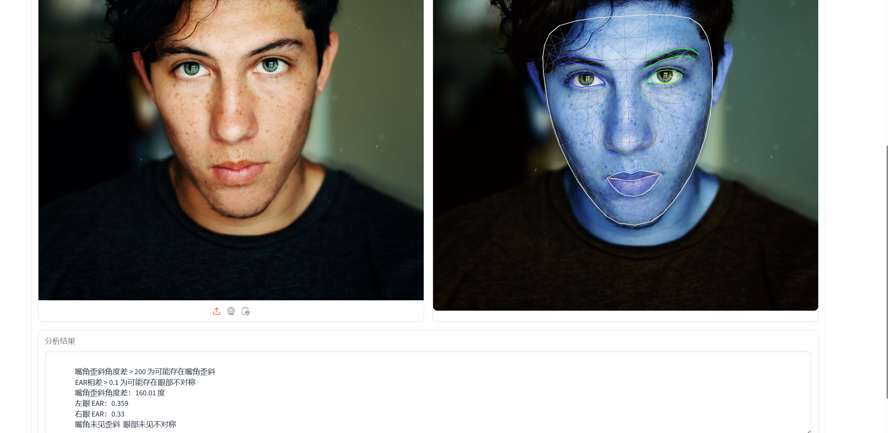
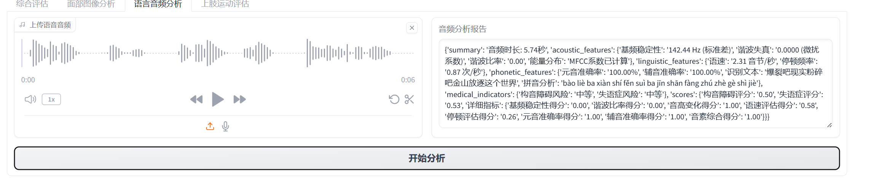
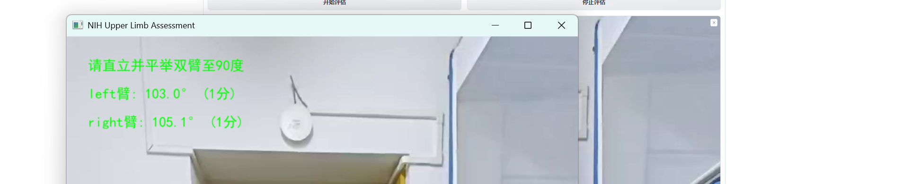
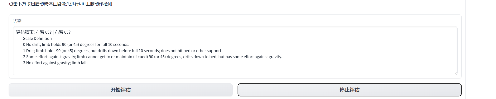
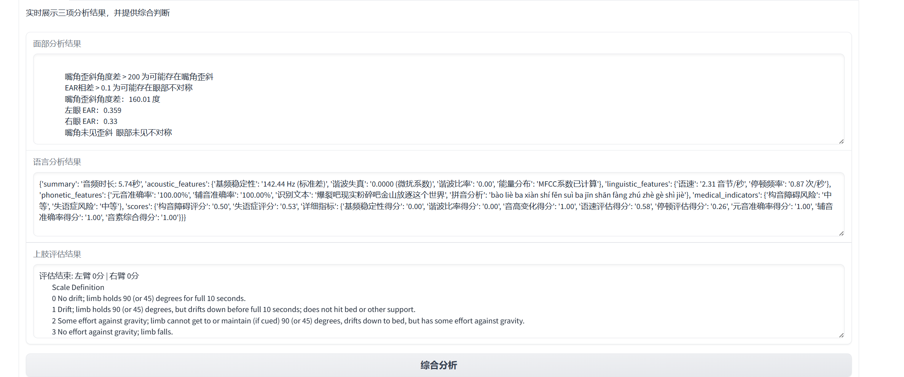
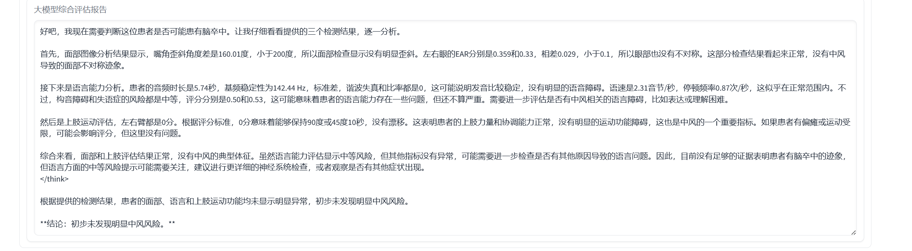

# Multimodal-Stroke-Predictor

Multimodal-Stroke-Predictor is a multimodal stroke prediction framework that leverages visual, physiological, and textual signals alongside large language models (LLMs) to assess the risk of cerebrovascular events. Based on Medical analysis standards, the system provides a novel and interpretable approach to early stroke detection.

## web ui

创建环境

```
conda create -n yourname python=3.9.22
pip install requirements.txt
```

创建.env文件 填入你的大模型链接以及你的api key

```
API_ENDPOINT="your llm"
API_TOKEN="your key"
```

然后启动webui

```
python interface.py
```

即可进入多模态中风早筛系统


根据指引完成面部 语音 上肢 三项的分析

可以选择上传图片或者摄像头拍照进行面部分析


点击分析即可查看面部分析结果



同样可以上传音频或者录音来进行声音分析


点击分析即可得到音频分析结果



最后可以选择上传视频或者摄像头录像 根据指引 进行上肢分析




可以点击停止评估提前结束分析 最后会得到上肢分析结果



随后即可在综合评测调用llm进行分析 最后得到分析结果



点击分析 即可得到大模型分析结果



可以看到得到结果未发现明显风险
