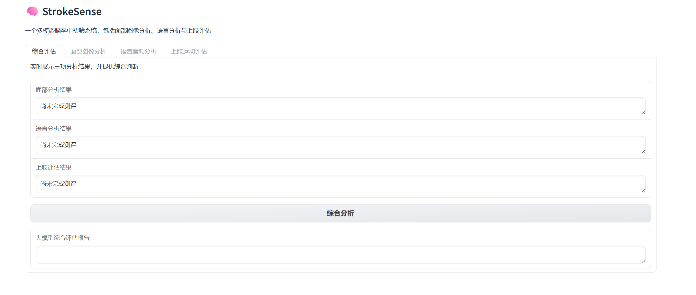

# Multimodal-Stroke-Predictor

Multimodal-Stroke-Predictor is a multimodal stroke prediction framework that leverages visual, physiological, and textual signals alongside large language models (LLMs) to assess the risk of cerebrovascular events. Based on Medical analysis standards, the system provides a novel and interpretable approach to early stroke detection.

## web ui

创建.env文件 填入你的大模型链接以及你的api key

```
API_ENDPOINT="your llm"
API_TOKEN="your key"
```

然后启动webui

```
python interface.pt
```

即可进入多模态中风早筛系统



根据指引完成面部 语音 上肢 三项的分析

随后即可在综合评测调用llm进行分析 最后得到分析结果
