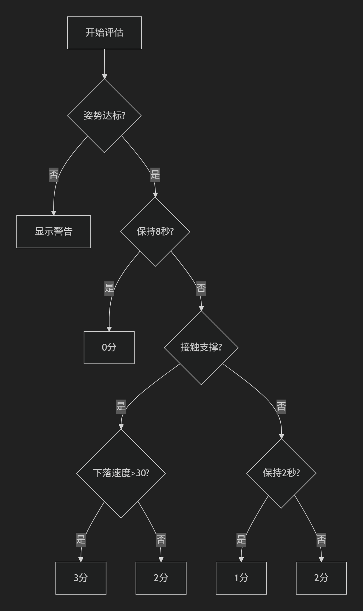

库版本信息：
========================================
NumPy           | 1.26.4
OpenCV          | 4.11.0
MediaPipe       | 0.10.21
Pillow          | 11.2.1

## 使用规则
python main.py -i <输入源>
**请尽量在视频中保持手臂侧平举90°**

## 评分逻辑

